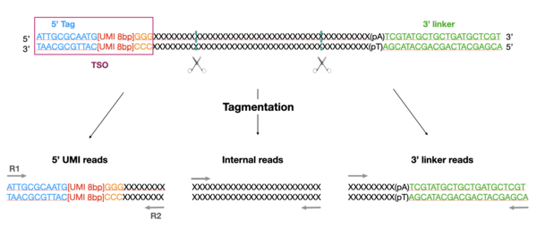

#  SmartSeq3/FlashSeq


**Institut Curie - Nextflow SmartSeq3/FlashSeq analysis pipeline**

[](https://www.nextflow.io/)
[](https://multiqc.info/)
[](https://conda.anaconda.org/anaconda)
[](https://singularity.lbl.gov/)
[](https://www.docker.com/)

### Introduction

The pipeline was built using [Nextflow](https://www.nextflow.io), a workflow tool to run tasks across multiple compute infrastructures in a very portable manner. 
It comes with containers making installation trivial and results highly reproducible.

### Pipeline Summary

The aim of the SmartSeq3 is to combine a full-length transcriptome coverage and a 5' UMI counting strategy to allow a better characterisation of single-cell transcriptomes. To do so, a template-switching oligo (TSO) is added in 5' parts of mRNAs (cf. figure below). The TSO is used for reverse transcription and Tn5-based tagmentation that randomly cut cDNAs. This leads to three types of reads: 5'UMI reads, internal reads and 3' linker reads. Finally, these reads are sequenced in a paired-end fashion and analyzed by this bioinformatic pipeline. 




1. Extract UMIs from tagged reads ([`umi-tools`](https://umi-tools.readthedocs.io/en/latest/))
3. Trim 3' linker and polyA tails ([`cutadapt`](https://cutadapt.readthedocs.io/en/latest/index.html))
4. Alignments ([`STAR`](https://github.com/alexdobin/STAR))
5. Remove PCR duplicates ([`samtools`](https://www.htslib.org/doc/samtools.html))
6. Assignments ([`FeatureCounts`](https://bioconductor.org/packages/release/bioc/vignettes/Rsubread/inst/doc/SubreadUsersGuide.pdf))
7. Generation of UMI count matrices ([`umi-tools`](https://umi-tools.readthedocs.io/en/latest/))
8. Generate QC plots 
9. Generate a 10X like matrix 
10. Results summary ([`MultiQC`](https://multiqc.info/))


### Quick help

```bash

N E X T F L O W  ~  version 20.01.0
======================================================================
SmartSeq3 v.1.0
======================================================================

Usage:

nextflow run main.nf --samplePlan 'sample_plan.csv' -profile conda --genomeAnnotationPath '/data/annotations/pipelines' --genome 'hg38'

Mandatory arguments:
    --reads [file]                Path to input data (must be surrounded with quotes)
    --samplePlan [file]           Path to sample plan input file (cannot be used with --reads)
    --genome [str]                Name of genome reference
    -profile [str]                Configuration profile to use. test / conda / multiconda / path / multipath / singularity / docker / cluster (see below)
  
  Inputs:
    --starIndex [dir]             Index for STAR aligner
    --singleEnd [bool]            Specifies that the input is single-end reads

  Skip options: All are false by default
    --skipSoftVersion [bool]      Do not report software version
    --skipMultiQC [bool]          Skips MultiQC

  Genomes: If not specified in the configuration file or if you wish to overwrite any of the references given by the --genome field
    --bed12                [path]    Path to gene file (BED12)
    --fasta                [path]    Path to genome fasta file
    --genomeAnnotationPath [path]    Path to genome annotations folder
    --gtf                  [path]    Path to GTF annotation file

  Other options:
    --outDir [path]               The output directory where the results will be saved
    -name [str]                   Name for the pipeline run. If not specified, Nextflow will automatically generate a random mnemonic
    --protocol [str]              Name of the protocol either "smartseq3" or "flashseq" or "liveseq"
    --sampleDescription [path]    Path to sampleDescription file. It has cell's bionames and allows to generate batches if generateBatch is true 
    --generateBatch [bool]        If true, group cells per batch. --sampleDescription needs to be given to get batch names
    --starOpts [bool]             Change star option; default is false
    --starDefaultOpts [str]       If starOpts is true, precise options. Default is in nextflow.config file
    --starTwoPass [bool]          Run two pass mode of star; default is false
    --featurecountsOpts [str]     Options for featureCounts quantification
 
  =======================================================
  Available Profiles

    -profile test                Set up the test dataset
    -profile conda               Build a single conda for with all tools used by the different processes before running the pipeline
    -profile multiconda          Build a new conda environment for each tools used by the different processes before running the pipeline
    -profile path                Use the path defined in the configuration for all tools
    -profile multipath           Use the paths defined in the configuration for each tool
    -profile docker              Use the Docker containers for each process
    -profile singularity         Use the singularity images for each process
    -profile cluster             Run the workflow on the cluster, instead of locally
```

### Quick run

The pipeline can be run on any infrastructure from a list of input files or from a sample plan as follow

#### Run the pipeline on a test dataset
See the conf/test.conf to set your test dataset.

```
nextflow run main.nf -profile test,conda

```

#### Run the pipeline from a `sample plan`
```
nextflow run main.nf --samplePlan MY_SAMPLE_PLAN --genome 'hg19' --genomeAnnotationPath ANNOTATION_PATH --outDir MY_OUTPUT_DIR

```

### Defining the '-profile'

By default (whithout any profile), Nextflow will excute the pipeline locally, expecting that all tools are available from your `PATH` variable.

In addition, we set up a few profiles that should allow you i/ to use containers instead of local installation, ii/ to run the pipeline on a cluster instead of on a local architecture.
The description of each profile is available on the help message (see above).

Here are a few examples of how to set the profile option.

```
## Run the pipeline locally, using a global environment where all tools are installed (build by conda for instance)
-profile path --globalPath INSTALLATION_PATH

## Run the pipeline on the cluster, using the Singularity containers
-profile cluster,singularity --singularityPath SINGULARITY_PATH

## Run the pipeline on the cluster, building a new conda environment
-profile cluster,conda --condaCacheDir CONDA_CACHE

```

### Sample Plan

A sample plan is a csv file (comma separated) that list all samples with their biological IDs.
The sample plan is expected to be created as below :

SAMPLE_ID,SAMPLE_NAME,FASTQ_DIR

You can give one cell per line with its corresponding directory, or one batch per line if your cells are grouped per batch in directories. 
If it is not the case but want to generate results per batches, use the option --generateBatch and give all your fastqs in one repository (one line in the sample plan).

### Sample Description

A sample description is a txt file (pipe separated) that list all cell IDs and biological names.
The sample plan is expected to be as below :

cell1_batch1|bio-name-cell-1
cell2_batch1|bio-name-cell-2
cell3_batch2|bio-name-cell-3
cell4_batch3|bio-name-cell-3
...

Batch information (e.g batch1) needs to be in the first column and separated by a "_" from the cellID (e.g cell1).

There is one fastq pair per cell so each fastq have to be named with the cellID_batch (e.g cell1_batch1) or with the biological name. 

### Run STAR with your own genome

1) Create star index with your fasta and gtf

STAR 2.7.8a is needed.

```
STAR  --runThreadN 4  \
    --genomeFastaFiles your_fasta.fa  \
    --sjdbGTFfile your_gtf.gtf \
    --runMode genomeGenerate --genomeDir new_STAR_2.7.8a/
```

2) Include star index and gtf paths to your nextflow command (parametres --gtf your_gtf.gtf --starIndex new_STAR_2.7.8a)

NB: If you have a bed12 file of your genome, add it to the nextflow command (--bed12 your_bed.bed12). It is used by RseqC which is a QC tool generating graphes for the multiqc html report. 

### Full Documentation

1. [Installation](docs/installation.md)
2. [Reference genomes](docs/reference_genomes.md)
3. [Running the pipeline](docs/usage.md)
4. [Output and how to interpret the results](docs/output.md)
5. [Troubleshooting](docs/troubleshooting.md)

#### Credits

This pipeline has been written by the single cell & bioinformatics platform of the Institut Curie (Louisa Hadj Abed, Celine Vallot, Nicolas Servant)

#### Contacts

For any question, bug or suggestion, please use the issues system or contact the bioinformatics core facility.
