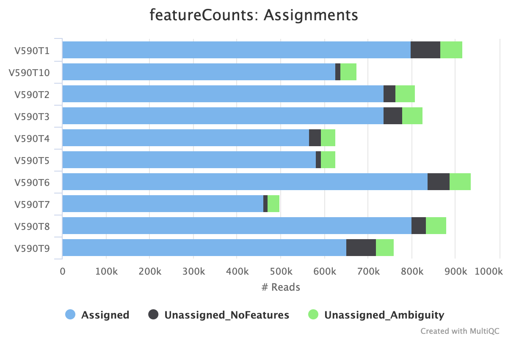

# Outputs

This document describes the output produced by the pipeline. 

## Pipeline overview

The pipeline is built using [Nextflow](https://www.nextflow.io/)
and processes the data using the steps presented in the main README file.  
Briefly, its goal is to process scRNAseq data from CSCO platform protocols (smartseq3 or flashseq).

The directories listed below will be created in the output directory after the pipeline has finished: 

```
results/
├── matrices/                         # Final gene expression/count matrices in sparse format
├── multiqc/                          # QC report generated by MultiQC
├── alignment/                        # Log files generated by STAR 
├── preprocessing/                    # Read preprocessing log files
│   ├── concatFastq/                 
│   ├── cutadapt/                     
│   └── umitoolsExtract/              
├── reads/                            # Final filtred bam files with all reads 
└── umi/                              # Final filtred bam files with UMI reads only
```

Plots are taken from the MultiQC report, which summarises results at the end of the pipeline.

## MultiQC report

[MultiQC](https://multiqc.info/) is a visualisation tool that generates a single HTML report summarising all samples in your project. Most of the pipeline QC results are visualised in the report, and further statistics are available within the report data directory.

The MultiQC report can be summarized as:
1. **Overview**
   * General Metrics 
2. **Raw sequencing QC**
   * FastQC
3. **Read preprocessing**
   * Cutadapt
   * UMI-tools
4. **Genome alignment**
   * STAR
5. **Read assignment**
   * featureCounts
6. **Alignment and RNA-seq QC**
7. **Single-cell QC**
   * RSeQC
   * Qualimap
   * Final reads per cell
   * Cell viability
   * Saturation analysis
8. **Reporting**
   * Software Versions
   * Workflow Summary

The MultiQC report brings together the QC results from these different stages into a single report, allowing the quality of the sequencing data and the different processing steps to be assessed at the sample level.

**Output directory: `multiqc/`**
* `scRNA-full-length_report.html`
  * MultiQC report - a standalone HTML file that can be viewed in a web browser.
* `mqc_files/`
  * Directory containing parsed statistics from the different tools used in the pipeline.

For more information about MultiQC, see [https://multiqc.info/](https://multiqc.info/).

### MultiQC section descriptions :

---

#### General Metrics

The **General Metrics** table provides an overview of the main QC metrics for each sample throughout the pipeline. It allows the user to quickly assess sequencing quality, read processing, alignment, assignment, UMI extraction and downstream single-cell metrics.

**Output directory: `multiqc/`**

* `general_stats.mqc`
  * Text file containing the general metrics table.

---

#### FastQC

[FastQC](https://www.bioinformatics.babraham.ac.uk/projects/fastqc/) provides general quality-control metrics for sequencing reads.

The MultiQC report includes the following FastQC metrics:

* **Sequence Quality Histograms**
  * Distribution of sequencing quality scores across reads.

* **Per Base Sequence Content**
  * Percentage of A, T, G and C at each position of the reads.
  * Deviations from the expected nucleotide composition can indicate sequencing or library-preparation biases.

* **Sequence Duplication Levels**
  * Distribution of duplicated sequences in the sequencing data.
  * High duplication levels can be expected in some single-cell and targeted sequencing applications and should therefore be interpreted in the context of the library preparation.

* **Top Overrepresented Sequences**
  * Lists sequences occurring more frequently than expected.
  * These sequences can correspond to adapters, primers, poly(A) sequences or other highly abundant sequences.

For further information, see the [FastQC documentation](https://www.bioinformatics.babraham.ac.uk/projects/fastqc/Help/).

**Output directory: `results/reads/`**
  * FastQC results generated from the sequencing reads are stored in this directory.

---

#### Cutadapt trimming

[Cutadapt](https://cutadapt.readthedocs.io/en/stable/) is used to remove unwanted sequences from the reads, including 3' linkers and poly(A) tails from R2.

The MultiQC report summarizes the trimming results, including the number and proportion of reads affected by adapter or poly(A) trimming.

**Output directory: `preprocessing/cutadapt/`**

* `*_cutadapt.log`
  * Log file summarizing the read-trimming process and the number of reads retained or discarded.

---

#### STAR alignment

[STAR](https://github.com/alexdobin/STAR) is used to align sequencing reads to the reference genome.

The STAR alignment statistics provide information about the total number of reads and their alignment status.

The main categories include:

* **Uniquely mapped**
  * Reads successfully aligned to a single genomic locus.
* **Mapped to too many loci**
  * Reads that aligned to multiple genomic locations above the allowed threshold.
* **Unmapped: too short**
  * Reads for which the aligned portion was too short to be considered a valid alignment.
* **Unmapped: other**
  * Reads that could not be aligned for other reasons, such as sequence mismatches, poor-quality sequences or potential contamination.

**Output directory: `alignment/`**

STAR log files are generated in this directory.

* `*_Log.out`
  * Main STAR alignment log and run parameters.

* `*_Log.progress.out`
  * Alignment progress and read-processing statistics generated during the STAR run.

* `*_Log.final.out`
  * Final STAR alignment summary and mapping statistics.

---

#### featureCounts assignment

[featureCounts](https://bioconductor.org/packages/release/bioc/html/Rsubread.html) is used to assign aligned reads to genomic features, typically genes or exons, based on the provided annotation.

The MultiQC report summarizes the proportion of reads successfully assigned to features and the main reasons for unassigned reads.



The main categories include:

* **Assigned**
  * Reads successfully assigned to a genomic feature.
* **Unassigned_NoFeatures**
  * Read alignments that do not overlap any annotated feature.
* **Unassigned_Ambiguity**
  * Read alignments that overlap multiple features and therefore cannot be unambiguously assigned.

Other unassigned categories may also be reported depending on the featureCounts configuration.

---

#### UMI-tools

[UMI-tools](https://umi-tools.readthedocs.io/) is used to extract and process Unique Molecular Identifiers (UMIs).

UMIs are molecular barcodes that can be used to distinguish individual RNA molecules and reduce the impact of PCR amplification duplicates.

The MultiQC report contains:

* **UMI extraction rate**
  * Percentage of reads from which a UMI could be successfully extracted.
* **UMI extraction regex match rate**
  * Percentage of reads matching the regular expression used to identify the expected UMI structure.

**Output directory: `preprocessing/umitoolsExtract/`**

* `*_umiExtract.log`
  * Log file summarizing the UMI extraction process.

---

#### RSeQC

[RSeQC](https://rseqc.sourceforge.net/) is used to evaluate RNA-seq alignment quality and characteristics of the aligned reads.

The MultiQC report contains several RSeQC metrics.

##### Inner Distance

The **Inner Distance** analysis provides information about the fragment size distribution between paired-end reads.

The resulting distribution can be used to evaluate the expected insert-size characteristics of the sequencing library.

##### Junction Annotation

The **Junction Annotation** analysis evaluates splice junctions detected from the aligned reads.

It provides information about the correspondence between detected junctions and annotated transcriptome/genome junctions.

##### Junction Saturation

The **Junction Saturation** analysis evaluates how the number of detected splice junctions increases with sequencing depth.

This provides an indication of whether additional sequencing is likely to identify substantial numbers of additional splice junctions.

---

#### Qualimap

[Qualimap](http://qualimap.conesalab.org/) is used to evaluate the quality of the sequencing alignment and coverage across the reference genome and annotated genes.

The MultiQC report contains the following Qualimap results.

##### Genomic origin of reads

This section summarizes the genomic regions where reads are located, such as:

* exonic regions;
* intronic regions;
* intergenic regions.

The distribution provides an overview of where the sequencing reads originate relative to the genome annotation.

#### Gene Coverage Profile

The **Gene Coverage Profile** describes the distribution of reads along annotated genes.

It can be used to assess whether coverage is uniformly distributed across genes or preferentially concentrated in specific regions.

---

### Final reads per cell

The **Final reads per cell** section summarizes the number of reads retained for individual cells after the main preprocessing and filtering steps.

This metric provides an overview of sequencing depth at the single-cell level and can be used to identify samples or cells with unusually low or high read counts.

---

### Cell viability

The **Cell viability** section summarizes the cell viability information associated with the samples.

This metric provides an overview of the proportion of viable cells and can be compared across samples to identify differences in sample quality before or during the sequencing workflow.

