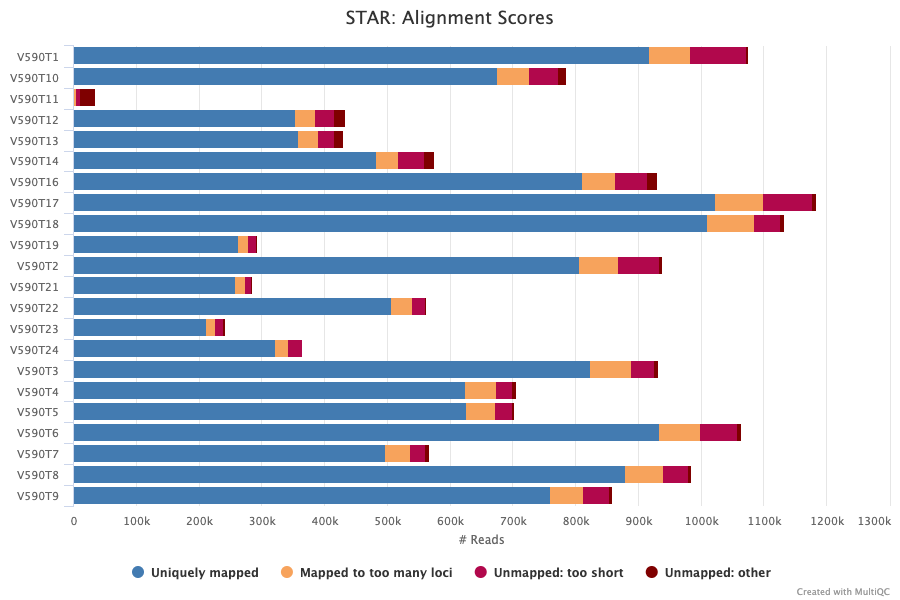
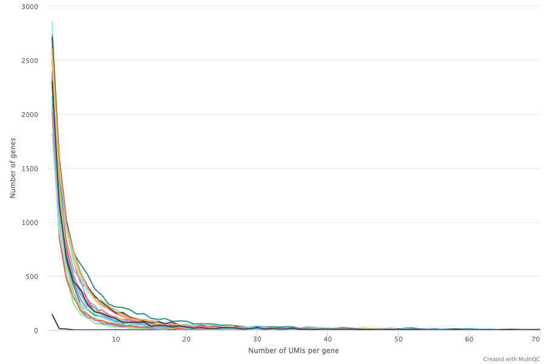
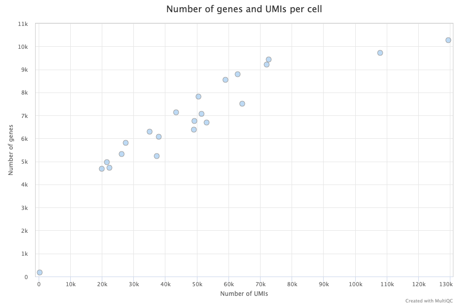
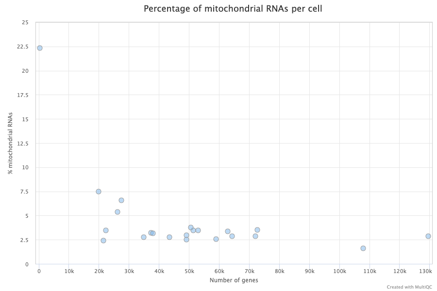

# Outputs

This document describes the output produced by the pipeline. Most of the plots are taken from the MultiQC report, which summarises results at the end of the pipeline.

## Pipeline overview

The pipeline is built using [Nextflow](https://www.nextflow.io/)
and processes the data using the steps presented in the main README file.  
Briefly, its goal is to process single cell RNAseq data obtained with smartSeq3 protocol.

The directories listed below will be created in the output directory after the pipeline has finished. 

The first part (Reads mapping) focuses on read QCs and the second part (Cell viability) explores umi and gene counts.

## Read mapping

### Mapping summary

The mapping part summarises alignment and assignment steps and shows the total proportion of correctly aligned and assigned reads (in blue) that will be used for further analysis.

- **Aligned_Assigned** : successfully aligned and assigned reads that are used for further analysis.  
- **Aligned_NotAssigned** : reads corresponding to one genome location but can't be assigned to a gene. 
- **NotAligned_NotAssigned** : bad quality reads.

Alignment and assignment are described in more detail in the two following parts.

### Alignment

[STAR](https://physiology.med.cornell.edu/faculty/skrabanek/lab/angsd/lecture_notes/STARmanual.pdf) software is used to aligned reads to a reference genome. Alignment statistics show the total number of reads in each sample and their alignment results.

- **Uniquely mapped** : successfully aligned reads to one single locus.  
- **Mapped too many** : reads mapped to more than 1 locus. 
- **Unmapped too short** : less than 66% of reads length (R1+R2) are correctly aligned on the genome. 
- **Unmapped other: other** : other reasons than "too short" or "too many" like for example due to a foreign genome contamination or if reads came from a
from a higly repeated region. 

A percentage representation can also be plotted. At least 70% of reads are expected to be uniquely mapped.

**Output directory: `readAlignment`**

* `[sample]Aligned.sortedByCoord.out.bam`
  * Aligned reads saved as BAM (Binary Alignment Map) file.
* `[sample]Log.final.out, [sample]Log.progress.out, [sample]Log.out`
  * Log files that sum up read alignements processing.

### Assignment

[FeatureCounts](https://bioconductor.org/packages/release/bioc/vignettes/Rsubread/inst/doc/SubreadUsersGuide.pdf) tool is used to assign reads to genes. Assignment statistics show the total number of reads in each sample and their assignment results as follow :

- **Assigned** : successfully assigned reads to genes.
- **Unassigned_NoFeatures** :  read alignments that do not overlap any exon (feature).
- **Unassigned_Ambiguity** : read alignments that overlap two or more exons (features) or genes (meta-features).

A percentage representation can also be plotted. A least 60% of aligned reads are expected to be assigned to a gene.

**Output directory: `readAssignment`**

* `[sample]Aligned.sortedByCoord.out.bam.featureCounts.bam`
  * Assignment results added to previous alignment file. The BAM file now have tagged reads as "Assigned" or "Unassigned". 
* `[sample]_counts.summary`
  * Assignment statistics summary.

### Number of UMIs per gene

The number of UMIs per gene represents gene expression level within each cell. Their distributions are plotted in the following graph. Number of UMIs per gene depends on sequencing depth. An upper limit of 70 UMIs (x axis) is set to allow a better representation. 

**Output directory: `umiPerGeneDist`**

* `[sample]_umi_HistUMIperGene_mqc.csv`
  * Tables of each distribution curve. First column is the number of UMIs, second column is the number of genes.

### Cutadapt

[Cutadapt](https://cutadapt.readthedocs.io/en/stable/) is used to trim 3'linkers (21bp in total) and polyA tails (arround 30bp long) on R2. Only few of them have a part of the pattern, generally ~2% and the majority mainly have 3 to 5bp that match. 

Results are summarized in a plot as follows:

**Output directory: `trimReads`**

* `[sample]_trimmed.R1.fastq`, `[sample]_trimmed.R2.fastq`
  * Fastq with deleted 3' linker and polyA tails. 
* `[sample]_trimmed.log`
  * Log file summurizing reads trimming.

### Gene body coverage

[Gene body coverage](http://rseqc.sourceforge.net/#genebody-coverage-py) script (from [RSeQC](http://rseqc.sourceforge.net/) package) shows the read coverage gene bodies. In SmartSeq3 data, reads containing a UMI correspond to the 5' part of genes whereas reads without UMI mainly cover the middle and the 3' part of genes.

**Output directory: `genebody_coverage`**

* `geneBodyCoverage/[sample]_umi.rseqc.geneBodyCoverage.curves.pdf`, `geneBodyCoverage/[sample]_NonUmi.rseqc.geneBodyCoverage.curves.pdf`
  * plot images in pdf format.
* `geneBodyCoverage/data/` , `geneBodyCoverage/rscripts/`
  * data used by gene_body_coverage.py to construct and output graph images.

## BAM files

Once the mapping step is done, resulting sequences are sorted and stored in [bam](https://samtools.github.io/hts-specs/SAMv1.pdf) files.

**Output directory: `sortBam`**

* `[sample]_Sorted.bam`
  * Bam files

## BigWig files

The [bigWig](https://genome.ucsc.edu/goldenpath/help/bigWig.html) format is in an indexed binary format useful for displaying dense, continuous data in Genome Browsers such as the [UCSC](https://genome.ucsc.edu/cgi-bin/hgTracks) and [IGV](http://software.broadinstitute.org/software/igv/). This mitigates the need to load the much larger BAM files for data visualisation purposes which will be slower and result in memory issues. The coverage values represented in the bigWig file can also be normalised in order to be able to compare the coverage across multiple samples - this is not possible with BAM files. Here, a CPM (counts er million) normalisation is used.
The bigWig format is also supported by various bioinformatics software for downstream processing such as meta-profile plotting.

**Output directory: `bigWig`**

* `[sample]_coverage.bw`
  * Bigwig files

## Cell metrics

From correctly aligned and assigned reads, UMIs and genes counts are analyzed.

### Ratio UMIs/transcrits per cell

Visualisation of the ratio UMIs/transcrits per cell in a dotplot as follow.

**Output directory: `cellAnalysis`**

* `RatioPerCell.csv`
  * Table grouping UMIs and transcrits counts per cell. First column is the sample, second column is the number of genes and last column is the number of UMIs. At least 5 000 genes and 30 000 UMIs are expectd by cell.  

### % Mitochondrial RNAs per cell

An important quality control in single cell data is the calculation of the percentage of mitochondrial (mt) transcrits over the total counts. Indeed, a high number of mt RNAs will reflect apoptotic, stressed or low-quality cells. The threshold can vary according accross cell types. 

**Output directory: `cellAnalysis`**

* `MtGenePerCell.csv`
  * Table grouping all mitochondrial transcrits counts accross samples. 

### UMI count matrices 

[umi-tools](https://umi-tools.readthedocs.io/en/latest/reference/count.html) is used to count the number of UMIs per gene and per sample and generate matrices.

**Output directory: `countMatrices`**

* `[sample]_umi_Counts.tsv.gz`
  * Matrice of two columns. The first one collect gene names and the second one, their UMI counts.
* `[sample]_umi_Counts.log`
  * umi-tools processing summary

A [10X format matrix](https://support.10xgenomics.com/single-cell-gene-expression/software/pipelines/latest/output/matrices) is also provided containing all cells and counts within one table.

**Output directory: `cellAnalysis/10Xoutput`**

## Complexity Curves

Preseq estimates the complexity of a library, showing how many additional unique reads are sequenced for increasing the total read count. 
A shallow curve indicates that the library has reached complexity saturation and further sequencing would likely not add further unique reads. 
The dashed line shows a perfectly complex library where total reads = unique reads.

> **NB:** Note that these are predictive numbers only, not absolute. The MultiQC plot shows extrapolation until 16 Millions of sequencing reads on the X axis - click and drag from the left side of the plot to zoom in on more realistic numbers.

**Output directory: `results/preseq`**

* `sample.extrap_ccurve.txt`
  * Results of complexity extrapolation up to 16 millions reads

## Gene-based Saturation

In addition to library complexity, we use a custom R script to infer the library complexity at the gene level. In this case, the script downsample the libraries and counts how many genes are detected (with at least 1 UMI). It therefore gives an overview of the number of detected genes at various sequencing depth.

**Output directory: `results/geneSaturation`**

* `counts.gcurve.txt`
  * Results of downsampling for all samples

## MultiQC

[MultiQC](http://multiqc.info) is a visualisation tool that generates a single HTML report summarising all samples in your project. Most of the pipeline QC results are visualised in the report and further statistics are available within the report data directory.

The pipeline has special steps which allow the software versions used to be reported in the MultiQC output for future traceability.

**Output directory: `multiqc`**

* `report.html`
  * MultiQC report - a standalone HTML file that can be viewed in your web browser.
* `multiqc_data/`
  * Directory containing parsed statistics from the different tools used in the pipeline.

For more information about how to use MultiQC reports, see http://multiqc.info.

