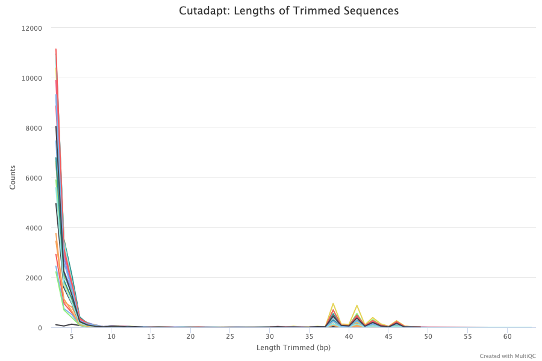
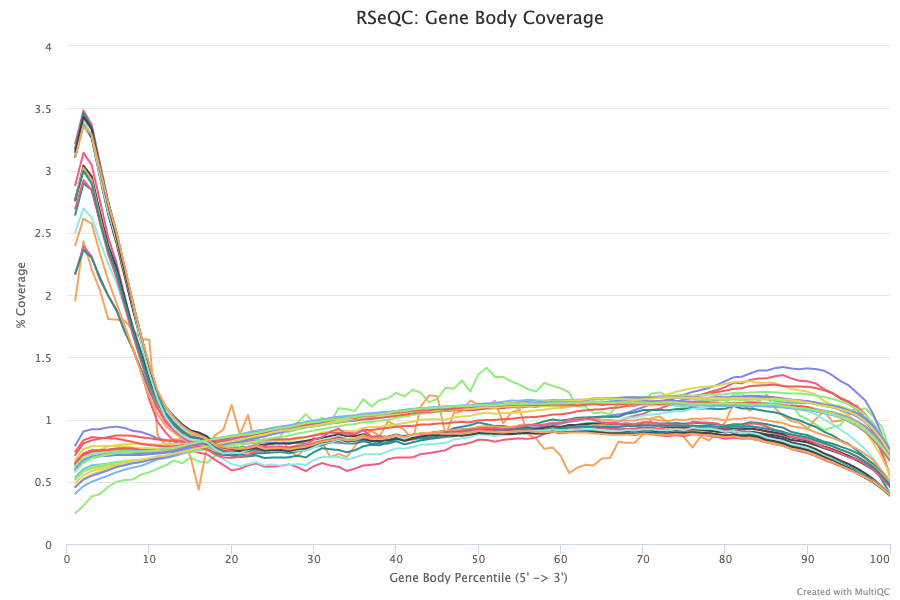

# Outputs

This document describes the output produced by the pipeline. Most of the plots are taken from the MultiQC report, which summarises results at the end of the pipeline.

## Pipeline overview

The pipeline is built using [Nextflow](https://www.nextflow.io/)
and processes the data using the steps presented in the main README file.  
Briefly, its goal is to process single cell RNAseq data obtained by a smartSeq3 protocol.

The directories listed below will be created in the output directory after the pipeline has finished. 

The first part (Reads mapping) focus on reads QC and the second part (Cell viability) explores umi and gene level.

## Reads mapping

### Mapping summary

The mapping summary part summarises alignement and assignment steps as follow:

- **Aligned_Assigned** : successfully aligned and assigned reads that are used for further analysis.  
- **Aligned_NotAssigned** : reads corresponding to one genome location but can't be assigned to a gene. 
- **NotAligned_NotAssigned** : bad quality reads.

Alignment and assignment are describe more in details in the two following outputs.

### Alignment

[STAR](https://physiology.med.cornell.edu/faculty/skrabanek/lab/angsd/lecture_notes/STARmanual.pdf) software is used to aligned reads to a reference genome. Alignment statistics show the total number of reads in each sample and their alignment results as follow :

- **Uniquely mapped** : successfully aligned reads.  
- **Mapped too many** : reads map to more than 1 loci. 
- **Unmapped too short** : less than 66% of reads length (R1+R2) are correctly aligned on the genome. 
- **Unmapped other: other** : other reason than "too short" or "too many" like for example due to a foreign genome contamination or if reads came from a
from a higly repeated region. 

**Output directory: `readAlignment`**

* `[sample]Aligned.sortedByCoord.out.bam`
  * Aligned reads save as BAM (Binary Alignment Map) file.
* `[sample]Log.final.out, [sample]Log.progress.out, [sample]Log.out`
  * Log files that sum up read alignements processing.

### Assignment

[FeatureCounts](https://bioconductor.org/packages/release/bioc/vignettes/Rsubread/inst/doc/SubreadUsersGuide.pdf) tool is used to assign reads to genes. Assignment statistics show the total number of reads in each sample and their assignment results as follow :

- **Assigned** : successfully assigned reads to genes.
- **Unassigned_NoFeatures** :  read alignments that do not overlap any exon (feature).
- **Unassigned_Ambiguity** : read alignments that overlap two or more exons (features) or genes (meta-features).

**Output directory: `readAssignment`**

* `[sample]Aligned.sortedByCoord.out.bam.featureCounts.bam`
  * Assignment results added to previous alignment file. The BAM file now have tagged reads as "Assigned" or "Unassigned". 
* `[sample]_counts.summary`
  * Assignment statistics summary.

From the aligned and assigned reads, the pipeline runs several quality control steps presented below.

### Cutadapt

[Cutadapt](https://cutadapt.readthedocs.io/en/stable/) is used to trim 3' linker and polyA tails. 
Results are summurized in an plot as follow:

**Output directory: `trimReads`**

* `[sample]_trimmed.R1.fastq`, `[sample]_trimmed.R2.fastq`
  * Fastq with deleted linker and polyA. 
* `[sample]_trimmed.log`
  * Log file summurizing reads trimming.

### Gene body coverage

[Gene body coverage](http://rseqc.sourceforge.net/#genebody-coverage-py) script from the [RSeQC](http://rseqc.sourceforge.net/) package is used to show how overall reads cover genes. In smartSeq3 data, reads attached to a UMI cover the 5' part of genes whereas reads without UMI cover the middle and the 3' part of genes.

## Cell viability

From correctly aligned and assigned reads, UMIs and genes counts are analyized.

### 

**Output directory: `preseq`**

* `sample_ccurve.txt`
  * Preseq expected future yield file.

## MultiQC
[MultiQC](http://multiqc.info) is a visualisation tool that generates a single HTML report summarising all samples in your project. Most of the pipeline QC results are visualised in the report and further statistics are available within the report data directory.

The pipeline has special steps which allow the software versions used to be reported in the MultiQC output for future traceability.

**Output directory: `multiqc`**

* `multiqc_report.html`
  * MultiQC report - a standalone HTML file that can be viewed in your web browser.
* `multiqc_data/`
  * Directory containing parsed statistics from the different tools used in the pipeline.

For more information about how to use MultiQC reports, see http://multiqc.info.
