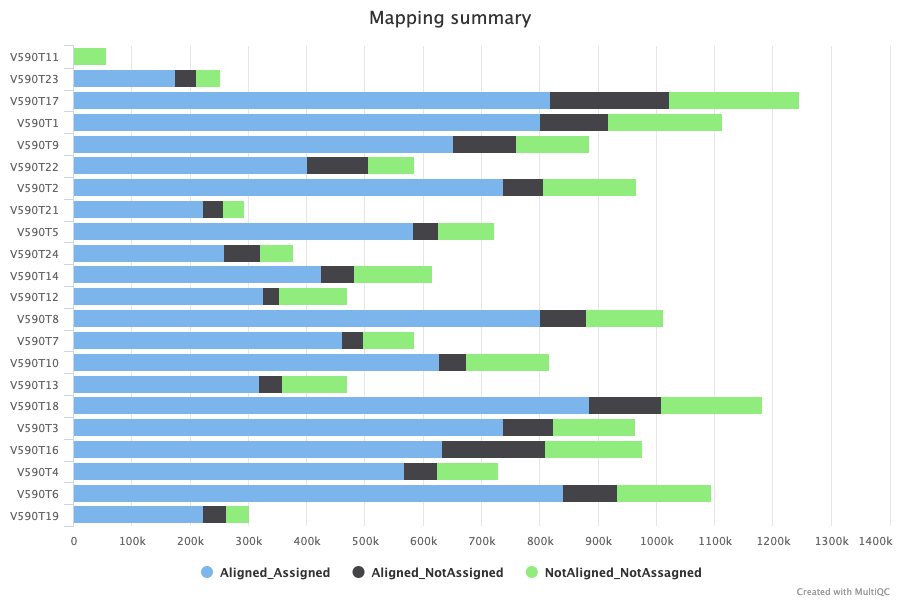
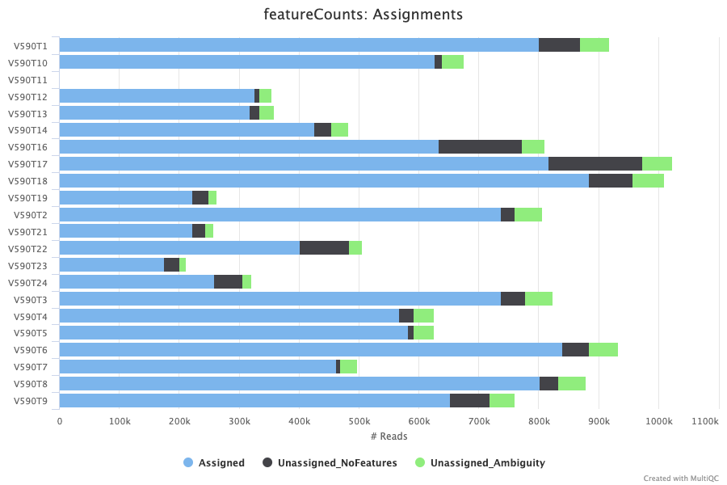
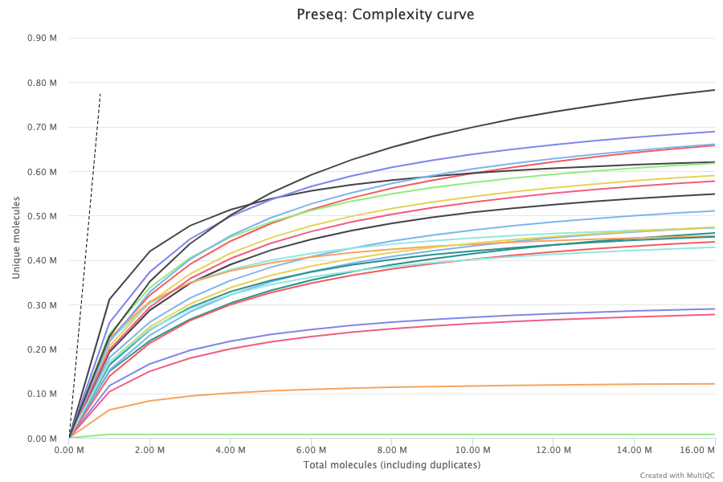

# Outputs

<!-- TODO update with the output of your pipeline -->

This document describes the output produced by the pipeline. Most of the plots are taken from the MultiQC report, which summarises results at the end of the pipeline.

## Pipeline overview

The pipeline is built using [Nextflow](https://www.nextflow.io/)
and processes the data using the steps presented in the main README file.  
Briefly, its goal is to process <!-- TODO --> data for any protocol, with or without control samples, and with or without spike-ins.

The directories listed below will be created in the output directory after the pipeline has finished. 

## Reads mapping

### Mapping summary

The mapping summary statistics are presented in the MultiQC report as follows.  

### Alignment

[STAR](https://physiology.med.cornell.edu/faculty/skrabanek/lab/angsd/lecture_notes/STARmanual.pdf) software is used to aligned transcrit reads to a reference genome. Alignment statistics show the total number of reads in each sample and their alignment results as follow :

- **Uniquely mapped** : mapping pass filtered conditions.  
- **Mapped too many** : the read map to more than 1 loci. 
- **Unmapped too short** : less than 66% of read length (R1+R2) is correctly aligned on the genome. 
- **Unmapped other: other** reason than "too short" or "too many" like for example due to a foreign genome contamination or if the read came from an unannotated reagion or from a higly repeated region. 

**Output directory: `readAlignment`**

* `[sample]Aligned.sortedByCoord.out.bam`
  * Aligned reads.
* `[sample]Log.final.out, [sample]Log.progress.out, [sample]Log.out`
  * Log files that sum up read alignements processing.

The alignment statistics are presented in the MultiQC report as follows.  

### Assignment

[FeatureCounts](https://bioconductor.org/packages/release/bioc/vignettes/Rsubread/inst/doc/SubreadUsersGuide.pdf) tool is used to assign reads to genes. Assignment statistics show the total number of reads in each sample and their assignment results as follow :

- **Assigned** : 
- **Unassigned_NoFeatures** : 
- **Unassigned_Ambiguity** : 

**Output directory: `readAssignment`**

* `[sample]Aligned.sortedByCoord.out.bam.featureCounts.bam`
  * Assignment results added to the previous alignment results. In the bam file, reads are tagged "Assigned" or "Unassigned". 
* `[sample]_counts.summary`
  * Assignment statistics summary.

## Cell viability

From the filtered and aligned read files, the pipeline runs several quality control steps presented below.

### Sequencing complexity

The [Preseq](http://smithlabresearch.org/software/preseq/) package aims at predicting and estimating the complexity of a genomic sequencing library, equivalent to predicting and estimating the number of redundant reads from a given sequencing depth and how many will be expected from additional sequencing using an initial sequencing experiment. The estimates can then be used to examine the utility of further sequencing, optimize the sequencing depth, or to screen multiple libraries to avoid low complexity samples. The dashed line shows a perfectly complex library where total reads = unique reads. Note that these are predictive numbers only, not absolute. The MultiQC plot can sometimes give extreme sequencing depth on the X axis - click and drag from the left side of the plot to zoom in on more realistic numbers.

**Output directory: `preseq`**

* `sample_ccurve.txt`
  * Preseq expected future yield file.

## MultiQC
[MultiQC](http://multiqc.info) is a visualisation tool that generates a single HTML report summarising all samples in your project. Most of the pipeline QC results are visualised in the report and further statistics are available within the report data directory.

The pipeline has special steps which allow the software versions used to be reported in the MultiQC output for future traceability.

**Output directory: `multiqc`**

* `multiqc_report.html`
  * MultiQC report - a standalone HTML file that can be viewed in your web browser.
* `multiqc_data/`
  * Directory containing parsed statistics from the different tools used in the pipeline.

For more information about how to use MultiQC reports, see http://multiqc.info.
